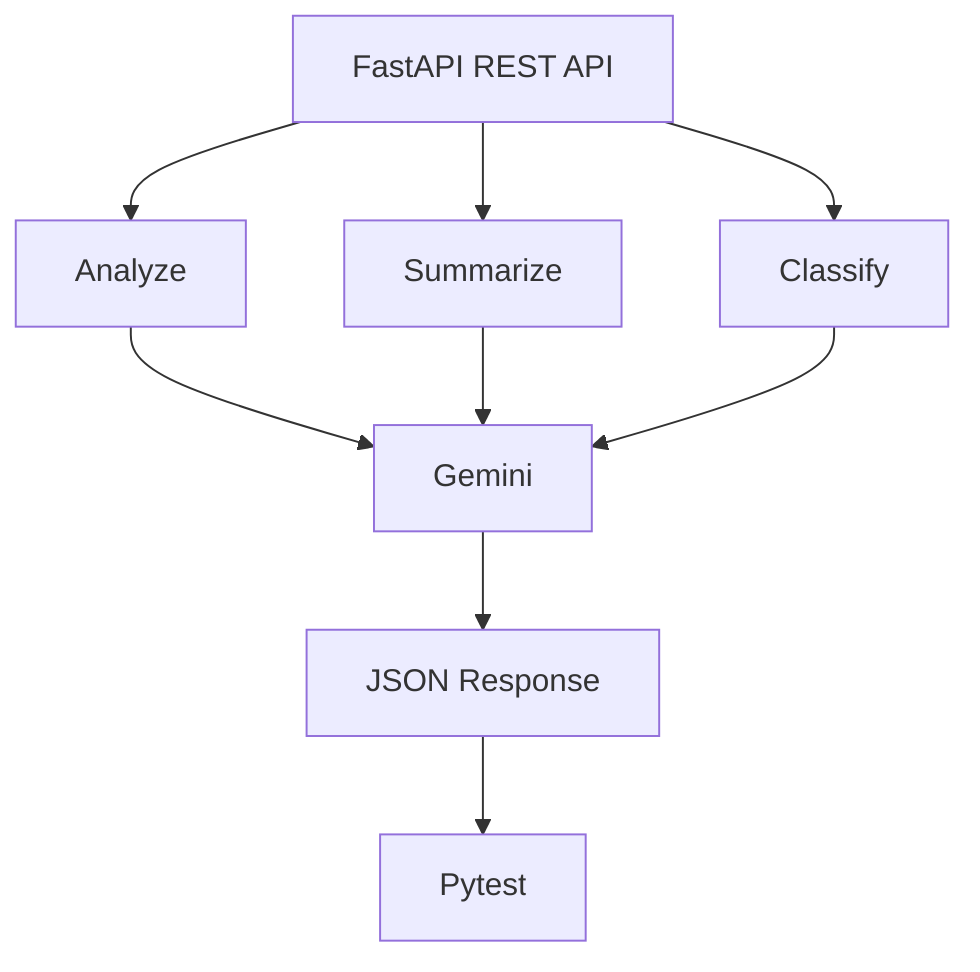

# AI Text Analysis API

A lightweight FastAPI web service that integrates with Google's Gemini API to provide text analysis, summarization, and classification endpoints.

## Architecture Diagram



Or in text representation:
```text
                 FastAPI REST API
                       │
        ┌──────────────┼──────────────┐
        ↓              ↓              ↓
     Analyze        Summarize      Classify
        │              │              │
        └──────────────┼──────────────┘
                       ↓
                    Gemini
                       ↓
                 JSON Response
                       │
                       ↓
                    Pytest
```

## Prerequisites
- Python 3.9+
- A Google Gemini API Key

## Setup & Installation

1. **Clone the repository:**
   ```bash
   git clone <your-repository-url>
   cd ai-text-analysis-api
   ```

2. **Create a virtual environment:**
   ```bash
   python -m venv venv
   # On Windows:
   .\venv\Scripts\activate
   # On macOS/Linux:
   source venv/bin/activate
   ```

3. **Install dependencies:**
   ```bash
   pip install -r requirements.txt
   ```

4. **Environment Variables:**
   Create a `.env` file in the root of the project and add your Gemini API key:
   ```env
   GEMINI_API_KEY=your_google_gemini_api_key_here
   ```

## Running the Application

To start the FastAPI development server:
```bash
uvicorn main:app --reload
```
The API will be available at `http://127.0.0.1:8000`.

## API Endpoints

You can view the interactive Swagger UI documentation at `http://127.0.0.1:8000/docs`.

- `GET /health`
  - Health check endpoint.

- `POST /analyze`
  - Body: `{"text": "Text to analyze"}`
  - Uses Gemini to analyze the provided text.

- `POST /summarize`
  - Body: `{"text": "Text to summarize"}`
  - Uses Gemini to summarize the provided text.

- `POST /classify`
  - Body: `{"text": "Text to classify"}`
  - Uses Gemini to classify the provided text into categories.

## Running Tests

To run the unit tests (which use a mock for the Gemini API to avoid network calls):
```bash
pytest
```
